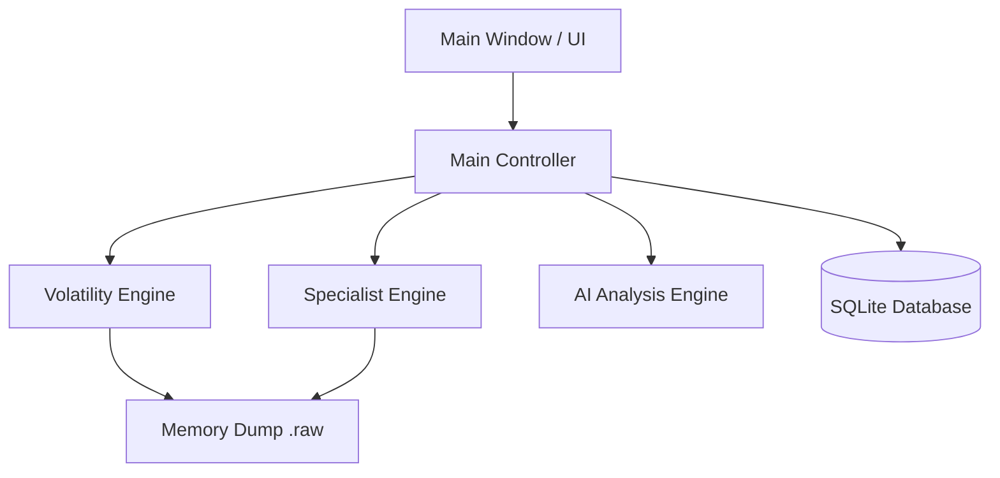

# MemNet: Unified Technical Report

## 1. Project Overview
MemNet is a state-of-the-art memory forensics platform that bridges the gap between raw data extraction and actionable intelligence. By integrating **Volatility 3**, **YARA-based specialist carving**, and **Google Gemini AI**, the platform provides investigators with a high-fidelity diagnostic environment.

## 2. System Architecture
The application follows a Controller-Worker pattern to ensure UI responsiveness while executing heavy forensic tasks.



---

## 3. Core Module Implementation

### 3.1 Platform Entry Point (`mft/main.py`)
Responsible for database initialization and launching the application lifecycle.

```python
import sys
from PyQt6.QtWidgets import QApplication
from mft.models.database import init_db
from mft.controllers.main_controller import MainController

def main():
    init_db()
    app = QApplication(sys.argv)
    controller = MainController()
    controller.show()
    sys.exit(app.exec())

if __name__ == "__main__":
    main()
```

### 3.2 Main Controller (`mft/controllers/main_controller.py`)
The central orchestrator managing signals, workers, and data flow between the forensic engines and the UI.

```python
# [Simplified for Report]
class MainController:
    def __init__(self):
        self.view = MainWindow()
        # ... signal connections ...
        self.view.processes_view.scan_pslist_btn.clicked.connect(lambda: self.run_vol_scan("pslist", ...))
        self.view.ai_analyst_view.generate_btn.clicked.connect(self.generate_ai_report)
    
    def run_vol_scan(self, plugin_name, view_widget):
        worker = VolScanWorker(self.current_filepath, plugin_name)
        worker.finished.connect(self.scan_finished)
        worker.start()
    
    def generate_ai_report(self):
        # Compiles context from DB and sends to Gemini AI
        pass
```

### 3.3 Volatility Engine (`mft/forensics/vol_engine.py`)
Direct integration with the Volatility 3 framework, bypassing CLI overhead for high-performance result parsing.

```python
class VolatilityEngine:
    def run_plugin(self, plugin_name, plugin_args=None):
        ctx = contexts.Context()
        # ... automagic configuration ...
        constructed = plugins.construct_plugin(ctx, automagics, plugin_opt, ...)
        tree_grid = constructed.run()
        return self._extract_tree_data(tree_grid)
```

### 3.4 Specialist Fast Scanner (`mft/forensics/fast_scanner.py`)
A custom, multi-processed YARA engine designed to carve strings and browser artifacts from raw memory at high speed.

```python
class FastYaraScanner:
    def scan(self):
        # Chunked parallel scan using ProcessPoolExecutor
        with ProcessPoolExecutor(max_workers=cpu_count) as executor:
            futures = [executor.submit(_scan_chunk_static, ...) for start, end in chunks]
        return self._filter_results(results)
```

### 3.5 AI Investigation Client (`mft/ai/gemini_client.py`)
Encapsulates Google Gemini API interactions with a built-in PII marking/redaction layer for forensic privacy.

```python
class GeminiClient:
    def generate_report(self, consolidated_ctx):
        system_instruction = "You are a Senior Digital Forensic Analyst..."
        safe_ctx = self.mask_pii(consolidated_ctx)
        response = self.client.models.generate_content(
            model="gemini-flash-latest",
            contents=system_instruction + safe_ctx
        )
        return response.text
```

---

## 4. UI/UX & Forensic Visualization

### 4.1 Relationship Graph View (`mft/views/graph_view.py`)
A custom QGraphicsScene implementation that maps process relationships and network nodes into a navigable 2D space.

```python
class GraphViewWidget(QWidget):
    def __init__(self):
        # ...
        def add_legend_item(color, text):
            # Legend with clinical dots and JetBrains Mono fonts
            pass

    def add_node(self, node_id, label, node_type, ...):
        node = GraphNode(node_id, label, node_type, metadata)
        self.scene.addItem(node)
```

### 4.2 Clinical Design System (`mft/views/styles.py`)
Global CSS definitions following the **Zimmerman Retro** aesthetic: light backgrounds, high contrast, and monospace typography.

```css
QTableWidget {
    background-color: #FFFFFF;
    gridline-color: #E5E7EB;
    font-family: 'JetBrains Mono', monospace;
    font-size: 12px;
}
QHeaderView::section {
    background-color: #F3F4F6;
    font-weight: bold;
}
```

---

## 5. Conclusion
MemNet provides a unified interface for complex memory forensics, combining the depth of traditional tools with modern AI analysis and visualization. The platform is optimized for performance, security (masked PII), and investigator workflow efficiency.
